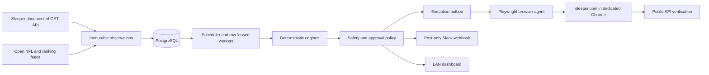

# Architecture

The system separates observation, decision, authorization, execution, and verification so that a bad feed or ambiguous UI state cannot silently become a destructive roster change.

## Trust boundaries

- `SleeperClient` can issue only GET requests to `https://api.sleeper.app/v1`. It has no credential fields and rejects alternate hosts and paths.
- Raw responses are content-hashed and inserted before normalization. Rejected payloads are retained as rejected observations; they never replace normalized last-known-good state.
- Deterministic, versioned code owns identity, eligibility, locks, source freshness,
  allowlists, and execution policy. Codex may choose and explain a roster-wide strategy
  only inside the supplied schema and programmatic action boundaries.
- The backend emits semantic commands. The browser agent owns all UI knowledge and never accepts raw coordinates.
- Trades and commissioner-setting actions are outside the command type system and are rejected again at the policy boundary.
- An uncertain browser commit moves to `unverified` and is never retried automatically.

## Execution lifecycle

`proposed → approval_required | ready → leased → preflight → executing → verifying → verified | unverified | failed | blocked`

An approval binds the exact add/drop pair, evidence hashes, and decision-policy version. It is short-lived and single-use. A changed binding invalidates it.

## Service boundaries

- `api`: loopback-only FastAPI, health/readiness, Prometheus metrics, dashboard reads, CSRF-protected approvals, authenticated browser-agent endpoints.
- `scheduler`: state-aware profiles for pre-draft, drafting, normal, waiver, game-day, kickoff, playoffs, and degraded sources.
- `worker`: durable domain events and notification deliveries using PostgreSQL row leasing.
- `frontend`: read-mostly Next.js dashboard exposed only on the configured private address.
- `browser-agent`: logged-in user LaunchAgent that runs Playwright against a dedicated signed-in Chrome profile and owns dry-run/qualified UI drivers.
- `db`: PostgreSQL system of record, kept on the internal APFS volume.

## Draft milestone

The draft engine ingests open FantasyPros ECR through DynastyProcess, maps conservatively to the Sleeper player catalog, excludes ambiguous identities, and scores available players by consensus value, league-derived replacement levels, tier cliffs, expected opponent demand, roster fit, uncertainty, and next-pick survival. For every realistic candidate it estimates the likely next-turn replacement, cost of waiting, and two-turn roster path. It also conditionally completes all 12 peer rosters and runs deterministic Monte Carlo regular-season/playoff paths, exposing modeled first-place probability and the delta from the candidate median. The configured league's lineup and scoring rules govern this calculation even when a standalone mock room has conflicting slots. The expert layer receives those paths alongside an authoritative roster trajectory, current strategy state, structural risks, role-secure options likely to survive, an elite-QB ceiling trigger, final-bench asymmetric-upside evidence, and a multi-turn market baseline. It must manage the chosen strategy across turns and compare plausible assembled rosters rather than accumulating isolated player values. The programmatic layer emits a recommendation and fallbacks as grounding evidence plus baseline simulations for every draft slot.

`DRAFT_PLAYER` uses the Playwright browser agent. It is qualified only for the configured league's snake-draft flow and fails closed unless the agent is authenticated, your roster is on the clock, the pick stream still matches the recommendation, and the recommended player remains available. Every submitted pick is verified through Sleeper's public picks endpoint.

## In-season milestone

The scheduler adaptively refreshes Sleeper state, nflverse data, identity mappings, and the
authenticated browser's roster, free-agent, and matchup projections. A local
ChatGPT-authenticated Codex worker reasons over the complete league and returns an exact legal
lineup plus conditional waiver plan. The backend independently reconstructs lineup changes
and validates every selected player and add/drop candidate. The `/manager` dashboard exposes
the plan and evidence.

Exact one-swap lineup execution is qualified and active for this league. The lineup compiler
displays the minimum exact swap sequence and schedules it 45 minutes before lock with full
before/after arrays and no uncertain retry. The action queue shows a live eligibility/expiry
countdown and permits owner cancellation until the browser agent holds an active lease. Waiver
commands remain unimplemented until that write
flow can be qualified and verified against transaction state. The current preview compiler
does already bind exact add/drop IDs, claim order, expected roster state, and Sleeper's observed
immediate-add versus waiver status so those invariants exist before UI qualification begins.
Immediate adds also have a dormant outbox synchronizer and exact public-roster preflight/verifier;
its independent feature flag is false and `ADD_FREE_AGENT` is not live-allowlisted. Pending waiver
claims remain separate because submission must be verified from Sleeper transaction state, not
from a roster change that has not happened yet.

The scheduler accelerates both evidence gathering and expert reconsideration as decisions become
time-sensitive. The local expert runs hourly normally, every 15 minutes in a waiver window,
every 10 minutes on game day, and every five minutes inside two hours of kickoff. Content-hash
caching makes unchanged reruns inexpensive. The limited FantasyPros tier is treated as a targeted
projection signal: four position-scoped requests per refresh cover our mapped roster first and rotate
the opponent overflow across refreshes. A durable rolling-24-hour ledger stops scheduled work at 40 of 50 requests and
preserves ten for manual emergencies. Records join through stable FantasyPros identifiers or an
exact name/position/team key; configuration alone is not reported as an active projection feed.
The emergency dashboard refresh is restricted to a local client, requires a CSRF token, observes a
15-minute cooldown, and may spend the protected reserve without weakening the hard 50-call ceiling.

Projection promotion is fail-closed. The daily evaluator selects the final snapshot strictly before
each player's kickoff and waits for the entire NFL week to complete. It scores the ensemble and each
paired source overall and by position, derives inverse-error position weights, and requires two weeks,
40 player-week samples, QB/RB/WR/TE coverage, calibrated P20-P80 intervals, and a 1% MAE win over the
strongest paired source. Passing those checks only makes the ensemble eligible; the explicit
`IN_SEASON_PLAN_V2_ENABLED` master switch is still required. Championship probabilities have a
separate structural gate for league coverage, simulation precision, live remaining-player state,
injury scenarios, correlations, future-opponent effects, and multi-week decay. Coverage is split into
95% complete legal team-weeks and 90% directly grounded starter projections; modeled replacement
starters may cover no more than 10% of slots. Implemented features remain shadow evidence until
historical replay marks each one qualified.
The championship replay is a separate daily artifact. It evaluates reported-player availability,
future-opponent shrinkage, shared-factor correlations, multi-week decay, and replacement values, and
scores persisted weekly win probabilities with Brier score, log loss, and reliability buckets as
outcomes become available. Roster-move scenarios use common random numbers and remain analysis-only.
The playoff engine follows Sleeper's documented fixed 2/4/6/8-team winners-bracket paths and rejects
unsupported playoff settings.
